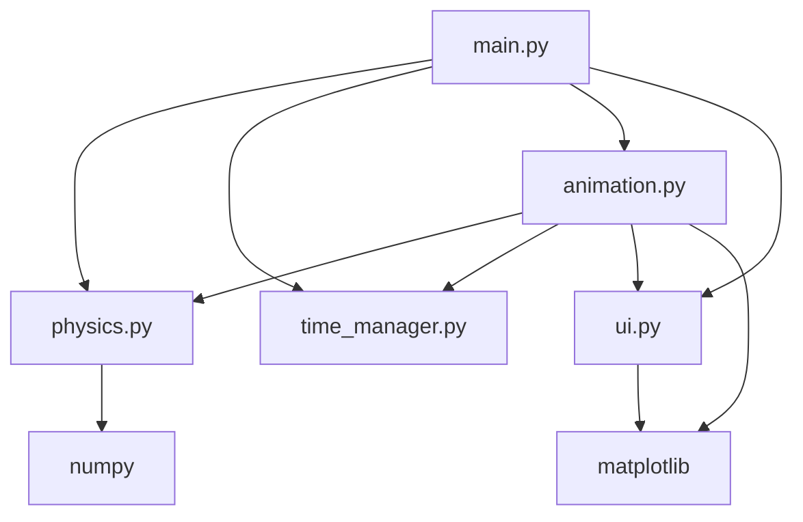
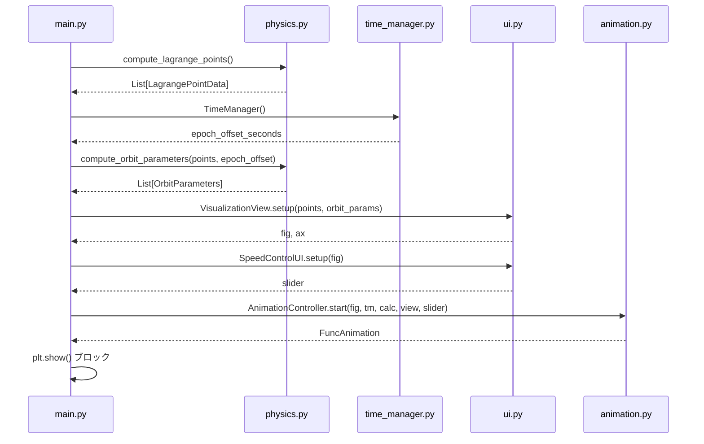
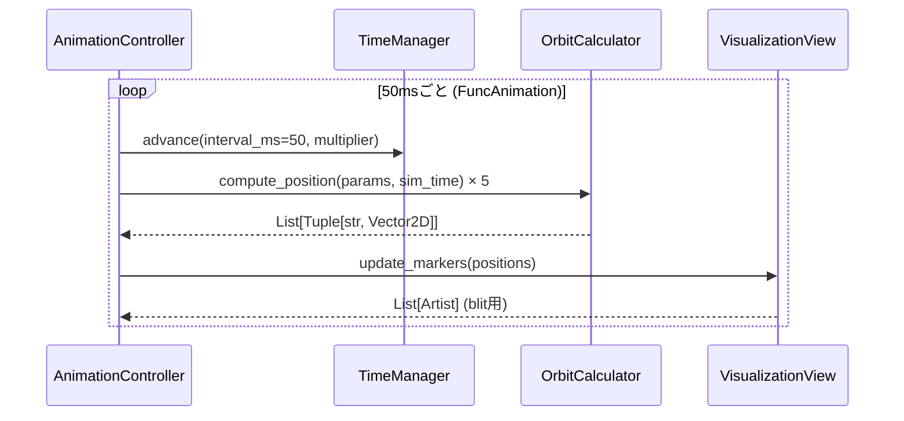

# Design Document — halo-orbit-visualizer

## Overview

**Purpose**: 太陽-地球系のL1〜L5ラグランジュポイント周辺のハロー（およびトロヤン型）軌道を2Dアニメーションで表示する、Linux Ubuntu向けPythonデスクトップアプリケーション。教育・概念把握を主目的とし、解析近似モデルを採用する。

**Users**: ハロー軌道を視覚的に理解したい一般ユーザーが起動・観察するシングルユーザーアプリ。

**Impact**: 既存コードベースへの変更なし。完全新規実装（Greenfield）。

### Goals

- L1〜L5の5つのラグランジュポイントと各周辺軌道を2D平面でアニメーション表示する
- 現在時刻（UTC）から軌道位相を算出し、アニメーションを開始する
- 時間倍率スライダーにより任意の速度でアニメーションを観察できる

### Non-Goals

- 倍率以外のパラメータ（軌道サイズ、初期時刻など）のUI変更
- 数値データのエクスポート
- 3D表示・リサジュー軌道・高精度数値積分

---

## Boundary Commitments

### This Spec Owns

- 太陽-地球系ラグランジュポイント（L1〜L5）の近似位置計算
- 各ラグランジュポイント周辺の近似軌道パラメータ計算（L1/L2/L3=ハロー近似、L4/L5=トロヤン近似）
- 軌道上オブジェクトの位置を時刻から算出するロジック
- matplotlibによる2Dアニメーション描画とFigureライフサイクル管理
- 時間倍率スライダーUIとアニメーションへの即時反映
- J2000エポックを基準とした現在時刻の取得と初期位相計算

### Out of Boundary

- 高精度な軌道伝播（STK、GMAT 等の専用ツール領域）
- 外部サービス・ネットワーク通信
- データ永続化・設定ファイル

### Allowed Dependencies

- Python 標準ライブラリ（`datetime`, `math`）
- `numpy` — ベクトル計算
- `matplotlib` — アニメーション・ウィジェット

### Revalidation Triggers

- matplotlib のメジャーバージョンアップで `FuncAnimation` または `Slider` API が変更された場合
- 軌道モデルをCR3BP数値積分に高度化する場合

---

## Architecture

### Architecture Pattern & Boundary Map

シンプル階層アーキテクチャを採用。依存方向は一方向（下層→上層への逆参照禁止）：

```
Types → Physics → TimeManager → AnimationController → UI
```



- **Selected pattern**: シンプル階層アーキテクチャ — 小規模単一プロセスアプリに最適
- **Boundary**: 各ファイルが単一の責務を持ち相互参照なし
- **New components rationale**: `physics.py` は物理計算、`time_manager.py` は時刻管理、`animation.py` はアニメーションループ制御、`ui.py` はmatplotlib描画のみを担当

### Technology Stack

| Layer | Choice / Version | Role | Notes |
|-------|-----------------|------|-------|
| UI / Animation | matplotlib ≥ 3.5 | Figure・Axes・FuncAnimation・Slider | 単体でGUI・アニメーション・ウィジェットを提供 |
| 数値計算 | numpy ≥ 1.21 | ベクトル演算・三角関数 | physics.py 内で使用 |
| 時刻 | Python datetime (stdlib) | UTC取得・J2000エポック換算 | `timezone.utc` を使用 |
| ランタイム | Python ≥ 3.8 | エントリーポイント | 標準Ubuntu環境で利用可能 |

---

## File Structure Plan

### Directory Structure

```
halo_orbit_visualizer/
├── main.py            # エントリーポイント。各コンポーネントを生成・接続して起動
├── types.py           # 共有データクラス（Vector2D, LagrangePointData 等）
├── physics.py         # LagrangePointCalculator, OrbitCalculator
├── time_manager.py    # TimeManager（シミュレーション時刻・倍率管理）
├── animation.py       # AnimationController（FuncAnimation ループ）
└── ui.py              # VisualizationView, SpeedControlUI（matplotlib 描画）
```

---

## System Flows

### 起動フロー



### アニメーションフレームループ



---

## Requirements Traceability

| Requirement | Summary | Component | Interface |
|-------------|---------|-----------|-----------|
| 1.1 | L1〜L5の近似位置計算 | LagrangePointCalculator | `compute_all()` |
| 1.2 | L1/L2/L3 ハロー軌道パラメータ | OrbitCalculator | `compute_parameters()` |
| 1.3 | L4/L5 トロヤン型軌道パラメータ | OrbitCalculator | `compute_parameters()` |
| 1.4 | 解析近似式のみ使用 | OrbitCalculator | scipy等不使用 |
| 2.1 | 起動時にGUIウィンドウを開く | VisualizationView | `setup()` |
| 2.2 | 太陽・地球・L1〜L5を図示 | VisualizationView | `setup()` |
| 2.3 | 軌道パスの描画 | VisualizationView | `setup()` |
| 2.4 | 軌道マーカーのアニメーション | AnimationController | `start()` + `update_markers()` |
| 2.5 | ラベル・凡例による識別表示 | VisualizationView | `setup()` |
| 2.6 | 定期フレーム更新 | AnimationController | `FuncAnimation(interval=50)` |
| 3.1 | 起動時にシステムUTC取得 | TimeManager | `__init__()` |
| 3.2 | 現在時刻から初期位相を算出 | OrbitCalculator | `compute_parameters(..., epoch_offset)` |
| 3.3 | 時刻取得失敗時は位相ゼロ | TimeManager | `__init__()` フォールバック |
| 4.1 | Python 3.8+・matplotlib のみ依存 | 全コンポーネント | imports 制約 |
| 4.2 | ウィンドウクローズで正常終了 | VisualizationView | `setup()` 内 close イベント |
| 4.3 | `python main.py` で起動 | main.py | `if __name__ == "__main__"` |
| 5.1 | 速度スライダーウィジェット表示 | SpeedControlUI | `setup()` |
| 5.2 | デフォルト倍率設定（起動直後から視認可能） | SpeedControlUI | `valinit=6`（10⁶倍） |
| 5.3 | 倍率変更をアニメーションに即時反映 | SpeedControlUI + AnimationController | `on_changed()` コールバック |
| 5.4 | ×1〜×10⁹の倍率範囲 | SpeedControlUI | `valmin=0, valmax=9` |
| 5.5 | 現在倍率の表示 | SpeedControlUI | `update_label()` |

---

## Components and Interfaces

### 共有型定義 (types.py)

| Component | Layer | Intent | Req Coverage |
|-----------|-------|--------|--------------|
| Vector2D | 型 | 2D座標値（AU単位） | 全体 |
| LagrangePointData | 型 | ラグランジュポイント名と位置 | 1.1 |
| OrbitParameters | 型 | 軌道形状・周波数・初期位相 | 1.2, 1.3, 3.2 |
| AnimationState | 型 | シミュレーション時刻・倍率の可変状態 | 2.4, 2.6, 5.3 |

##### State Management

```python
from dataclasses import dataclass

@dataclass(frozen=True)
class Vector2D:
    x: float  # AU
    y: float  # AU

@dataclass(frozen=True)
class LagrangePointData:
    name: str                # "L1" | "L2" | "L3" | "L4" | "L5"
    position: Vector2D       # AU, 回転座標系（太陽=原点、地球=(1,0)）

@dataclass(frozen=True)
class OrbitParameters:
    lagrange_point_name: str
    semi_axis_x: float       # AU（視覚的誇張スケール込み）
    semi_axis_y: float       # AU（視覚的誇張スケール込み）
    angular_frequency: float # rad/s
    initial_phase: float     # rad (J2000起算の現在時刻から算出)

@dataclass
class AnimationState:
    sim_time_seconds: float  # J2000エポック起算の仮想時刻（秒）
    time_multiplier: float   # 1.0〜1e9
```

---

### Physics Layer (physics.py)

#### LagrangePointCalculator

| Field | Detail |
|-------|--------|
| Intent | 太陽-地球系5つのラグランジュポイントの近似位置を計算 |
| Requirements | 1.1 |

**Responsibilities & Constraints**
- μ = m_Earth/(m_Sun + m_Earth) ≈ 3.003×10⁻⁶ を定数として保持
- Hill sphere近似（L1/L2）、反対側近似（L3）、正三角形（L4/L5）を用いる
- 回転座標系（AU）で返す。太陽=(0,0)、地球=(1,0)

**Contracts**: Service [x]

##### Service Interface

```python
from typing import List
from .types import LagrangePointData

class LagrangePointCalculator:
    def compute_all(self) -> List[LagrangePointData]:
        """L1〜L5の5点を計算して返す。呼び出し毎に同一結果（副作用なし）"""
        ...
```

- Preconditions: なし
- Postconditions: 返り値リストは必ず5要素、順序は L1, L2, L3, L4, L5

---

#### OrbitCalculator

| Field | Detail |
|-------|--------|
| Intent | 各ラグランジュポイントの軌道パラメータ計算と、任意時刻での軌道位置計算 |
| Requirements | 1.2, 1.3, 1.4, 3.2 |

**Responsibilities & Constraints**
- 解析近似式のみ使用（scipy 等の数値積分ライブラリ不使用）
- L1/L2/L3: CR3BP 線形化の中心多様体近似（楕円近似、周期≈6ヶ月）
- L3: CR3BP の反対側平衡点近似（周期≈1年）
- L4/L5: 地球と同周期（365.25日）の小円軌道近似
- 軌道サイズは教育的視認性のため誇張係数を適用（物理的正確さより可視性優先）

**Contracts**: Service [x]

##### Service Interface

```python
from typing import List
from .types import LagrangePointData, OrbitParameters, Vector2D

class OrbitCalculator:
    def compute_parameters(
        self,
        lagrange_points: List[LagrangePointData],
        epoch_offset_seconds: float,
    ) -> List[OrbitParameters]:
        """
        各ラグランジュポイントの軌道パラメータを返す。
        epoch_offset_seconds: J2000起算の現在時刻（秒）。初期位相の算出に使用。
        """
        ...

    def compute_position(
        self,
        params: OrbitParameters,
        sim_time_seconds: float,
    ) -> Vector2D:
        """
        任意の仮想時刻における軌道オブジェクトの位置（AU）を返す。
        ラグランジュポイントのローカル座標系での相対位置を返す（呼び出し元が加算）。
        """
        ...
```

- Preconditions: `lagrange_points` は5要素（LagrangePointCalculator の出力）
- Postconditions: `compute_parameters` は5要素を返す
- Invariants: `compute_position` は決定論的（同一入力→同一出力）

---

### Time Layer (time_manager.py)

#### TimeManager

| Field | Detail |
|-------|--------|
| Intent | 現在UTC取得・J2000エポック換算・アニメーション仮想時刻の管理 |
| Requirements | 3.1, 3.2, 3.3 |

**Responsibilities & Constraints**
- J2000.0 エポック = 2000-01-01 12:00:00 UTC を基準とする
- `datetime.now(timezone.utc)` で現在時刻を取得（Python 3.12対応）
- 取得失敗時は `epoch_offset_seconds = 0.0` にフォールバック（要件3.3）
- `advance()` は `sim_time_seconds` のみを更新し、副作用なし

**Contracts**: State [x]

##### State Management

```python
from datetime import datetime, timezone

class TimeManager:
    def __init__(self) -> None:
        """
        コンストラクタで現在UTC時刻を取得しJ2000起算秒を算出。
        取得失敗時は epoch_offset_seconds = 0.0 でフォールバック。
        """
        ...

    @property
    def epoch_offset_seconds(self) -> float:
        """J2000エポック起算の初期時刻（秒）。読み取り専用。"""
        ...

    @property
    def sim_time_seconds(self) -> float:
        """現在のシミュレーション仮想時刻（J2000起算秒）。"""
        ...

    def advance(self, real_delta_ms: float, multiplier: float) -> None:
        """
        アニメーションフレームごとに呼び出す。
        sim_time_seconds += (real_delta_ms / 1000.0) * multiplier
        """
        ...
```

---

### Animation Layer (animation.py)

#### AnimationController

| Field | Detail |
|-------|--------|
| Intent | FuncAnimation ループを管理し、物理計算・UI更新を毎フレーム調整する |
| Requirements | 2.4, 2.6, 5.3 |

**Dependencies**
- Inbound: main.py — 初期化・起動 (P0)
- Outbound: TimeManager.advance() — 仮想時刻進行 (P0)
- Outbound: OrbitCalculator.compute_position() — 位置計算 (P0)
- Outbound: VisualizationView.update_markers() — 描画更新 (P0)
- External: matplotlib.animation.FuncAnimation (P0)

**Contracts**: Service [x]

##### Service Interface

```python
from typing import List
from matplotlib.animation import FuncAnimation
from matplotlib.figure import Figure
from .types import OrbitParameters
from .time_manager import TimeManager
from .physics import OrbitCalculator
from .ui import VisualizationView, SpeedControlUI

class AnimationController:
    FRAME_INTERVAL_MS: int = 50  # 20 FPS

    def start(
        self,
        fig: Figure,
        orbit_params: List[OrbitParameters],
        lagrange_positions: list,  # List[LagrangePointData]
        time_manager: TimeManager,
        orbit_calculator: OrbitCalculator,
        view: "VisualizationView",
        speed_ui: "SpeedControlUI",
    ) -> FuncAnimation:
        """
        FuncAnimation を生成・返す。plt.show() 呼び出し前に実行する。
        speed_ui.on_changed コールバックも内部で登録する。
        """
        ...
```

- Preconditions: `fig` はアクティブな matplotlib Figure
- Postconditions: 返り値の `FuncAnimation` は `plt.show()` 中に動作する

**Implementation Notes**
- `blit=True` を使用。`update_markers()` が返す Artist リストのみ再描画
- SpeedControlUI の Axes は blit 対象外（静的表示のため）
- フレーム更新関数のシグネチャ: `def _update_frame(self, frame: int) -> List[Artist]`

---

### UI Layer (ui.py)

#### VisualizationView

| Field | Detail |
|-------|--------|
| Intent | matplotlib Figure を構築し、静的要素（背景・軌道パス・ラベル）の初期描画と動的マーカーの更新を担当 |
| Requirements | 2.1, 2.2, 2.3, 2.5, 4.2 |

**Contracts**: Service [x] State [x]

##### Service Interface

```python
from typing import List, Tuple
from matplotlib.figure import Figure
from matplotlib.axes import Axes
from matplotlib.artist import Artist
from .types import LagrangePointData, OrbitParameters, Vector2D

class VisualizationView:
    def setup(
        self,
        lagrange_points: List[LagrangePointData],
        orbit_params: List[OrbitParameters],
    ) -> Tuple[Figure, Axes]:
        """
        Figure・Axes を生成し、太陽・地球・L1〜L5位置・軌道パス・凡例を描画。
        ウィンドウクローズ時に plt.close('all') を呼ぶイベントを登録する（要件4.2）。
        スライダー用の余白を bottom=0.2 で確保する。
        """
        ...

    def update_markers(
        self,
        positions: List[Tuple[str, Vector2D]],
    ) -> List[Artist]:
        """
        各ラグランジュポイントの軌道マーカー位置を更新。
        blit 用に変更された Artist のリストを返す。
        positions: [(lagrange_point_name, absolute_position_AU), ...]
        """
        ...
```

---

#### SpeedControlUI

| Field | Detail |
|-------|--------|
| Intent | log10スケールのSliderウィジェットで時間倍率を提供し、現在値をラベル表示する |
| Requirements | 5.1, 5.2, 5.3, 5.4, 5.5 |

**Contracts**: State [x]

##### State Management

```python
from matplotlib.figure import Figure
from matplotlib.widgets import Slider

class SpeedControlUI:
    # スライダー値は log10(multiplier)。範囲 [0, 9]、デフォルト 6（=10⁶倍）
    SLIDER_MIN: float = 0.0
    SLIDER_MAX: float = 9.0
    SLIDER_DEFAULT: float = 6.0

    def setup(self, fig: Figure) -> Slider:
        """
        Figure の下部に Axes を作成し Slider を配置して返す。
        初期値は SLIDER_DEFAULT（=×10⁶）。
        ラベルには "Speed: 10^N (×M)" 形式で現在倍率を表示する。
        """
        ...

    def get_multiplier(self, slider_value: float) -> float:
        """slider_value（log10スケール）を実倍率に変換: 10 ** slider_value"""
        ...

    def update_label(self, slider: Slider, multiplier: float) -> None:
        """スライダーのラベルを現在の倍率値で更新する。"""
        ...
```

---

## Error Handling

### Error Strategy

- **Fail Fast**: TimeManager の初期化時にのみ例外をキャッチし、フォールバック値を設定する
- **Graceful Degradation**: 時刻取得失敗時は位相ゼロで動作継続（要件3.3）

### Error Categories and Responses

| エラー種別 | 発生箇所 | 対応 |
|-----------|---------|------|
| `datetime` 取得失敗 | `TimeManager.__init__()` | `epoch_offset_seconds = 0.0` にフォールバック、stderr に警告出力 |
| matplotlib バックエンド非対応 | `main.py` 起動時 | 例外をキャッチせず終了（ユーザーがバックエンド設定を修正する） |
| ウィンドウクローズ | `VisualizationView.setup()` | `close_event` で `plt.close('all')` を呼び正常終了 |

---

## Testing Strategy

### Unit Tests

- `LagrangePointCalculator.compute_all()`: L1とL2が地球から等距離（Hill sphere近似）であること、L4/L5が太陽・地球から等距離（正三角形）であること
- `OrbitCalculator.compute_position()`: `sim_time = 0` と `sim_time = period` で同一位置が返ること（周期性）
- `TimeManager.advance()`: `advance(1000, 1e6)` で `sim_time_seconds` が 10⁶ 秒増加すること
- `SpeedControlUI.get_multiplier()`: `slider_value=0` → `1.0`、`slider_value=9` → `1e9`

### Integration Tests

- 起動フロー全体: `main.py` の初期化シーケンスが例外なく完了し、`FuncAnimation` オブジェクトが生成されること
- フレーム更新: `AnimationController._update_frame(0)` を呼び出し、返り値が空でない `List[Artist]` であること

### 手動確認項目

- スライダーを左端（×1）にした際にマーカーがほぼ静止すること
- スライダーを右端（×10⁹）にした際にマーカーが高速に周回すること
- ウィンドウを閉じた際にプロセスが正常終了すること（ゾンビプロセスが残らないこと）
